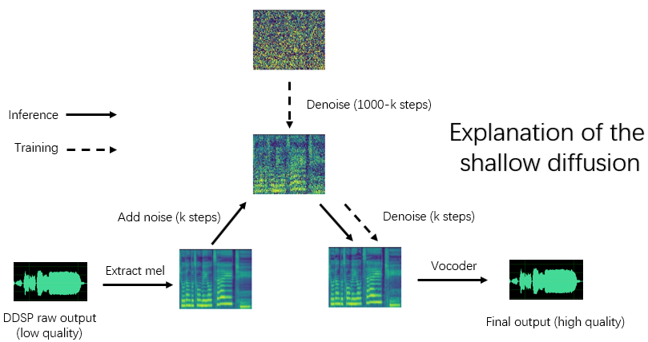

Language: **Korean & English** [简体中文](./cn_README.md) [한국어](./ko_README.md)
# DDSP-SVC-KOR
## Discord server (diff-svc 레포지토리 커뮤니티인데, DDSP 관련 얘기도 많음)
[](https://nguard.xyz/invite/diffsvckr)

# * 주의사항 *
## 1. **모르는건 물어봐도 되는데 대답이 느릴 수 있습니다**(위쪽에 Issues에 지금까지의 질답들이 있습니다. 모르는건 디스코드에서 물어보는게 더 빠릅니다.)
## 2. **이 프로젝트는 학술 교류 목적으로 설립되었으며 프로덕션 환경을 위한 것이 아닙니다. 본 프로젝트의 모델에서 발생하는 음원으로 인해 발생하는 저작권 문제에 대해서는 책임을 지지 않습니다.**
# local GPU에서 DDSP-SVC 사용방법
## 0.코드 구동을 위한 프로그램 설치 및 코드, 체크포인트 다운로드
1. 아나콘다3 설치 (https://www.anaconda.com/products/distribution)
    - 설치 중간에 PATH환경변수에 추가하겠냐는 질문이 있는데, 이 단계에서 등록하는게 마음이 편함
2. ffmpeg 설치 (https://www.gyan.dev/ffmpeg/builds/)
    - 압축해제한 폴더/bin 을 PATH환경변수에 추가해줘야 함
    - Debian 혹은 Ubuntu Linux의 경우 다음 명령으로 설치
        ```
        sudo apt install ffmpeg
        ```
3. CUDA 11.8 설치 (https://developer.nvidia.com/cuda-11-8-0-download-archive?target_os=Windows&target_arch=x86_64&target_version=10&target_type=exe_local)
    - 재시작이 있을 수 있음
    - 리눅스의 경우 nvidia드라이버가 설치되어 있다면 따로 설치할 필요없음. 
4. C++ Build Tool이용해서 C++ 14.x 버전 설치
    - [Build Tools 다운로드](https://visualstudio.microsoft.com/ko/visual-cpp-build-tools/)
    - 선택항목들 설치 (체크항목들을 설치하면 문제없이 프로젝트 진행 가능)
        
5. 현재 repository를 .zip으로 다운로드
    - 압축해제 경로 전체에 한글이 없는게 좋음
    - 압축해제하면 DDSP-SVC-KOR-main 폴더가 생김
    - Linux라면 다음 명령어로 다운로드
        ```
        sudo apt install git
        git clone https://github.com/wlsdml1114/DDSP-SVC-KOR.git
        ```
6. checkpoint 다운로드
    - **(필수)** [**HubertSoft**](https://github.com/bshall/hubert/releases/download/v0.1/hubert-soft-0d54a1f4.pt)   인코더를 다운로드 받아서 `pretrain/hubert` 폴더 아래에 넣어준다.
        - [ContentVec](https://ibm.ent.box.com/s/z1wgl1stco8ffooyatzdwsqn2psd9lrr)을 humbert 대신에 사용할 수 있음(Optional), config를 좀 바꾸긴 해야댐
    -  **(필수)** 사전학습된 vocoder를 쓸 수도 있음 [DiffSinger Community Vocoders Project](https://openvpi.github.io/vocoders) 에서 맨 아래에 link에서 nsf_hifigan_20221211.zip 다운로드 받아서 `pretrain/` 폴더 안에 압축 해제
## 1. 학습환경 세팅
- 관리자 권한으로 anaconda prompt 열기
- 아나콘다 가상환경 생성
    - `conda create -n ddsp python=3.9`
- 가상환경 진입
    - `conda activate ddsp`
- pip upgrade
    - `python -m pip install --upgrade pip`
- pytorch 설치
    - [**official website**](https://pytorch.org/)
    - 본인 쿠다 버전에 맞춰서 다운로드
    - `pip3 install torch torchvision torchaudio --index-url https://download.pytorch.org/whl/cu118`
- 프로젝트 폴더로 이동
    - 본인의 경우 C:\Users\wlsdm\project\DDSP-SVC-KOR\
        `cd C:\Users\wlsdm\project\DDSP-SVC-KOR\`
- 필요한 라이브러리들 설치
    - `pip install -r requirements.txt`
## 2. 데이터 준비 및 전처리, 학습
- notebook.ipynb의 순서를 따르면 됩니다.
- jupyter lab 켜는법
    - 아나콘다 프롬프트에 `jupyter-lab` 치면 chrome이 자동으로 열립니다
    - 안열리면 `localhost:8888/lab` 으로 들어가세요
- 왼쪽 파일 목록에서 notebook.ipynb를 키고 자신의 조건에 따라서 데이터 전처리 ~ 학습까지 진행하시면 됩니다.
## 3. 결과 추론
- notebook.ipynb의 맨 아래에 4. 결과물 뽑기에서 3가지만 세팅해주면 된다. (초보자의 경우)
    ```
    'model_path'            :   'exp/combsub-test/model_best.pt', # 추론에 사용하고자 하는 모델, 바로위에서 학습한 모델을 가져오면댐
    'input'                 :   'data/train/audio/video-0000.wav', # 추론하고자 하는 노래파일의 위치 - 님들이 바꿔야댐 
    'output'                :   'output.wav',  # 결과물 파일의 위치
    ```

# DDSP-SVC
<div align="center">
</img>
</div>
Real-time end-to-end singing voice conversion system based on DDSP (Differentiable Digital Signal Processing）.

## (3.0 - Experimental) Shallow diffusion model (DDSP + Diff-SVC refactor version)


Data preparation, configuring the pre-trained encoder (hubert or contentvec ) and vocoder (nsf-hifigan) is the same as training a pure DDSP model.

Because the diffusion model is more difficult to train, we provide some pre-trained models here:

https://huggingface.co/datasets/ms903/Diff-SVC-refactor-pre-trained-model/blob/main/hubertsoft_pitch_410k/model_0.pt (using 'hubertsoft' encoder)

https://huggingface.co/datasets/ms903/Diff-SVC-refactor-pre-trained-model/blob/main/pitch_400k/model_0.pt (using 'contentvec768l12' encoder)

Move the `model_0.pt` to the model export folder specified by the 'expdir' parameter in `diffusion.yaml`, and the program will automatically load the pre-trained models in that folder.

(1) Preprocessing：
```bash
python preprocess.py -c configs/diffusion.yaml
```
This preprocessing can also be used to train the DDSP model without preprocessing twice, but you need to ensure that the parameters under the 'data' tag in yaml files are consistent.

(2) Train a diffusion model：
```bash
python train_diff.py -c configs/diffusion.yaml
```
(3) Train a DDSP model：
```bash
python train.py -c configs/combsub.yaml
```
As mentioned above, re-preprocessing is not required, but please check whether the parameters of `combsub.yaml` and `diffusion.yaml` match. The number of speakers 'n_spk' can be inconsistent, but try to use the same number to represent the same speaker (this makes inference easier).

(4) Non-real-time inference：
```bash
python main_diff.py -i <input.wav> -ddsp <ddsp_ckpt.pt> -diff <diff_ckpt.pt> -o <output.wav> -k <keychange (semitones)> -id <speaker_id> -diffid <diffusion_speaker_id> -speedup <speedup> -method <method> -kstep <kstep>
```

'speedup' is the acceleration speed, 'method' is 'pndm' or 'dpm-solver', 'kstep' is the number of shallow diffusion steps, 'diffid' is the speaker id of the diffusion model, and other parameters have the same meaning as `main.py`.

If the same id has been used to represent the same speaker during training, '-diffid' can be empty, otherwise the '-diffid' option needs to be specified.

If '-ddsp' is empty, the pure diffusion model is used, at this time, shallow diffusion is performed with the mel of the input source, and if further '-kstep' is empty, full-depth Gaussian diffusion is performed.

The program will automatically check whether the parameters of the DDSP model and the diffusion model match (sampling rate, hop size and encoder), and if they do not match, it will ignore loading the DDSP model and enter Gaussian diffusion mode.

Real-time GUI：
```bash
python gui_diff.py
```

## 0. Introduction
DDSP-SVC is a new open source singing voice conversion project dedicated to the development of free AI voice changer software that can be popularized on personal computers.

Compared with the more famous [Diff-SVC](https://github.com/prophesier/diff-svc) and [SO-VITS-SVC](https://github.com/svc-develop-team/so-vits-svc),  its training and synthesis have much lower requirements for computer hardware, and the training time can be shortened by orders of magnitude. In addition, when performing voice change in real-time, the hardware resources of this project are significantly lower than SO-VITS-SVC, and Diff-SVC is too slow to perform voice change in real-time.

Although the original synthesis quality of DDSP is not ideal (the original output can be heard in tensorboard while training), after using the pre-trained vocoder-based enhancer, the sound quality for some dateset can reach a level close to SO-VITS-SVC.

If the quality of the training data is very high, probably still Diff-SVC will have the highest sound quality. The demo outputs are in the `samples` folder,  and the related model checkpoint can be downloaded from the release page.

Disclaimer: Please make sure to only train DDSP-SVC models with **legally obtained authorized data**, and do not use these models and any audio they synthesize for illegal purposes. The author of this repository is not responsible for any infringement, fraud and other illegal acts caused by the use of these model checkpoints and audio.

Update log: I am too lazy to translate, please see the Chinese version readme.

## 1. Installing the dependencies
We recommend first installing PyTorch from the [**official website**](https://pytorch.org/), then run:
```bash
pip install -r requirements.txt 
```
NOTE : I only test the code using python 3.8 (windows) + torch 1.9.1 + torchaudio 0.6.0, too new or too old dependencies may not work

UPDATE: python 3.8 (windows) + cuda 11.8 + torch 2.0.0 + torchaudio 2.0.1 works, and training is faster.
## 2. Configuring the pretrained model
UPDATE:  ContentVec encoder is supported now. You can download the pretrained [ContentVec](https://ibm.ent.box.com/s/z1wgl1stco8ffooyatzdwsqn2psd9lrr) encoder instead of HubertSoft encoder and modify the configuration file to use it.
- **(Required)** Download the pretrained [**HubertSoft**](https://github.com/bshall/hubert/releases/download/v0.1/hubert-soft-0d54a1f4.pt)   encoder and put it under `pretrain/hubert` folder.
-  Get the pretrained vocoder-based enhancer from the [DiffSinger Community Vocoders Project](https://openvpi.github.io/vocoders) and unzip it into `pretrain/` folder
## 3. Preprocessing

Put all the training dataset (.wav format audio clips) in the below directory:
`data/train/audio`. 
Put all the validation dataset (.wav format audio clips) in the below directory:
`data/val/audio`.
You can also run
```bash
python draw.py
```
to help you select validation data (you can adjust the parameters in `draw.py` to modify the number of extracted files and other parameters)

Then run
```bash
python preprocess.py -c configs/combsub.yaml
```
for a model of combtooth substractive synthesiser (**recommend**), or run
```bash
python preprocess.py -c configs/sins.yaml
```
for a model of sinusoids additive synthesiser.

You can modify the configuration file `config/<model_name>.yaml` before preprocessing. The default configuration is suitable for training 44.1khz high sampling rate synthesiser with GTX-1660 graphics card.

NOTE 1: Please keep the sampling rate of all audio clips consistent with the sampling rate in the yaml configuration file ! If it is not consistent, the program can be executed safely, but the resampling during the training process will be very slow.

NOTE 2: The total number of the audio clips for training dataset is recommended to be about 1000,  especially long audio clip can be cut into short segments, which will speed up the training, but the duration of all audio clips should not be less than 2 seconds. If there are too many audio clips, you need a large internal-memory or set the 'cache_all_data' option to false in the configuration file.

NOTE 3: The total number of the audio clips for validation dataset is recommended to be about 10, please don't put too many or it will be very slow to do the validation.

NOTE 4:  If your dataset is not very high quality, set 'f0_extractor' to 'crepe' in the config file.  The crepe algorithm has the best noise immunity, but at the cost of greatly increasing the time required for data preprocessing.

UPDATE: Multi-speaker training is supported now. The 'n_spk' parameter in configuration file controls whether it is a multi-speaker model.  If you want to train a **multi-speaker** model, audio folders need to be named with **positive integers not greater than 'n_spk'** to represent speaker ids, the directory structure is like below:
```bash
# training dataset
# the 1st speaker
data/train/audio/1/aaa.wav
data/train/audio/1/bbb.wav
...
# the 2nd speaker
data/train/audio/2/ccc.wav
data/train/audio/2/ddd.wav
...

# validation dataset
# the 1st speaker
data/val/audio/1/eee.wav
data/val/audio/1/fff.wav
...
# the 2nd speaker
data/val/audio/2/ggg.wav
data/val/audio/2/hhh.wav
...
```
If 'n_spk'  = 1, The directory structure of the **single speaker** model is still supported, which is like below:
```bash
# training dataset
data/train/audio/aaa.wav
data/train/audio/bbb.wav
...
# validation dataset
data/val/audio/ccc.wav
data/val/audio/ddd.wav
...
```
## 4. Training
```bash
# train a combsub model as an example
python train.py -c configs/combsub.yaml
```
The command line for training other models is similar.

You can safely interrupt training, then running the same command line will resume training.

You can also finetune the model if you interrupt training first, then re-preprocess the new dataset or change the training parameters (batchsize, lr etc.) and then run the same command line.

## 5. Visualization
```bash
# check the training status using tensorboard
tensorboard --logdir=exp
```
Test audio samples will be visible in TensorBoard after the first validation.

NOTE: The test audio samples in Tensorboard are the original outputs of your DDSP-SVC model that is not enhanced by an enhancer. If you want to test the synthetic effect after using the enhancer  (which may have higher quality) , please use the method described in the following chapter.
## 6. Non-real-time VC
(**Recommend**) Enhance the output using the pretrained vocoder-based enhancer:
```bash
# high audio quality in the normal vocal range if enhancer_adaptive_key = 0 (default)
# set enhancer_adaptive_key > 0 to adapt the enhancer to a higher vocal range
python main.py -i <input.wav> -m <model_file.pt> -o <output.wav> -k <keychange (semitones)> -id <speaker_id> -eak <enhancer_adaptive_key (semitones)>
```
Raw output of DDSP:
```bash
# fast, but relatively low audio quality (like you hear in tensorboard)
python main.py -i <input.wav> -m <model_file.pt> -o <output.wav> -k <keychange (semitones)> -id <speaker_id> -e false
```
Other options about the f0 extractor and response threhold，see:
```bash
python main.py -h
```
(UPDATE) Mix-speaker is supported now. You can use "-mix" option to design your own vocal timbre, below is an example:
```bash
# Mix the timbre of 1st and 2nd speaker in a 0.5 to 0.5 ratio
python main.py -i <input.wav> -m <model_file.pt> -o <output.wav> -k <keychange (semitones)> -mix "{1:0.5, 2:0.5}" -eak 0
```
## 7. Real-time VC
Start a simple GUI with the following command:
```bash
python gui.py
```
The front-end uses technologies such as sliding window, cross-fading, SOLA-based splicing and contextual semantic reference, which can achieve sound quality close to non-real-time synthesis with low latency and resource occupation.

Update: A splicing algorithm based on a phase vocoder is now added, but in most cases the SOLA algorithm already has high enough splicing sound quality, so it is turned off by default. If you are pursuing extreme low-latency real-time sound quality, you can consider turning it on and tuning the parameters carefully, and there is a possibility that the sound quality will be higher. However, a large number of tests have found that if the cross-fade time is longer than 0.1 seconds, the phase vocoder will cause a significant degradation in sound quality.
## 8. Acknowledgement
* [ddsp](https://github.com/magenta/ddsp)
* [pc-ddsp](https://github.com/yxlllc/pc-ddsp)
* [soft-vc](https://github.com/bshall/soft-vc)
* [DiffSinger (OpenVPI version)](https://github.com/openvpi/DiffSinger)
# DDSP-SVC-KOR-master
"# DDSP-SVC-KOR-master" 
